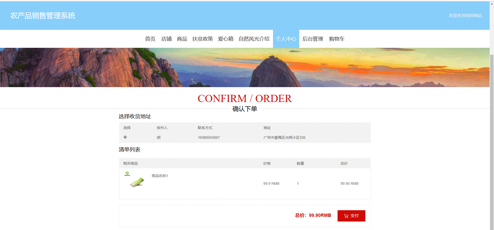
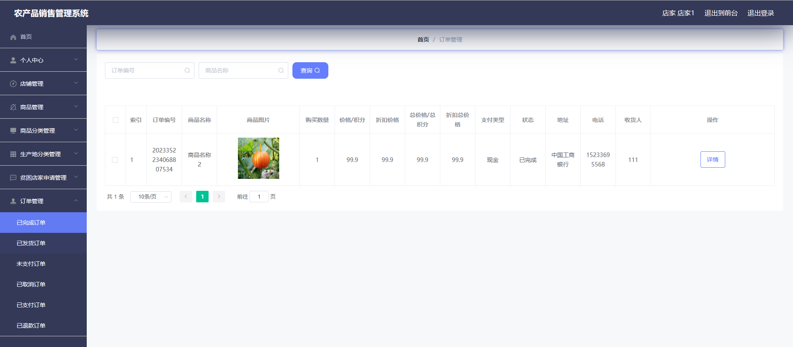
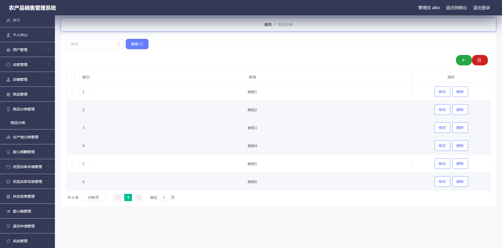
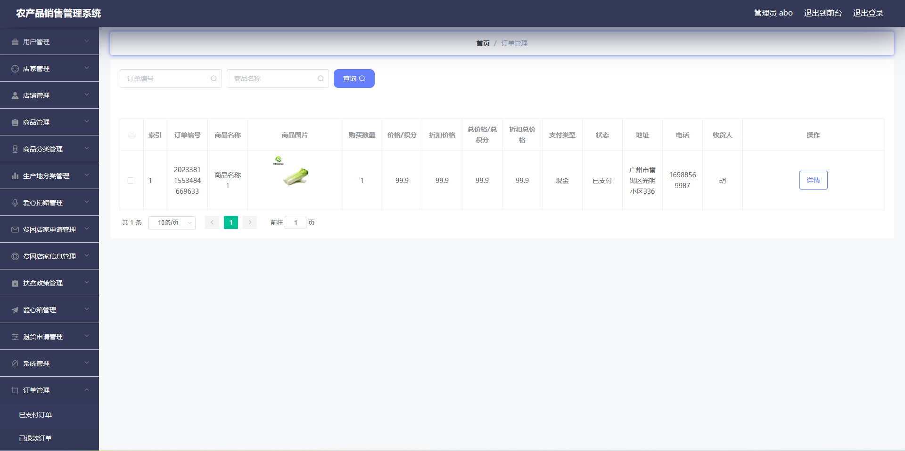

# 农产品销售管理系统

有问题，或者不会调试运行的同学, 可以添加微信：xzxj0206

## 介绍
基于SpringBoot和Mybatis的农产品销售系统/商城

## 一、项目功能介绍
本系统分为用户、店家和管理员三种角色；

### 1、用户模块主要功能包括：

1、登录/注册，2、主页浏览，3、商家店铺浏览，4、评论浏览，5、发表评论，6、农产品浏览，7、自然风光介绍，8、修改个人信息，9、查看农产品介绍，10、修改个人资料，11、查看订单，12、编辑收获地址，13、收藏农产品和查看收藏，14、购买农产品，15、查看购物车，16、申请退货，17、查看农业扶贫信息，18、爱心捐赠

### 2、商家模块主要功能包括：

1、修改密码，2、修改商家信息，3、商品管理，4、商品分类管理，5、生成地分类管理，6、贫困店家申请管理，7、订单管理

### 3、管理员模块主要功能包括：
1、修改密码和个人，2、用户管理（新增用户和删除用户），3、商家管理（新增商家和删除商家），4、店铺管理，5、商品管理，6、商品分类管理，7、生产产地分类管理，8、爱心捐赠管理，9、贫困店家申请管理，10、贫困店家信息管理，11、爱心箱管理，12、退款申请管理，13、轮播图管理，14、自然风光管理，15、全部订单管理

## 二、部分页面展示
### 1、用户模块部分功能页面展示

### 2、商家模块部分功能页面展示

### 3、管理员模块部分功能页面展示

